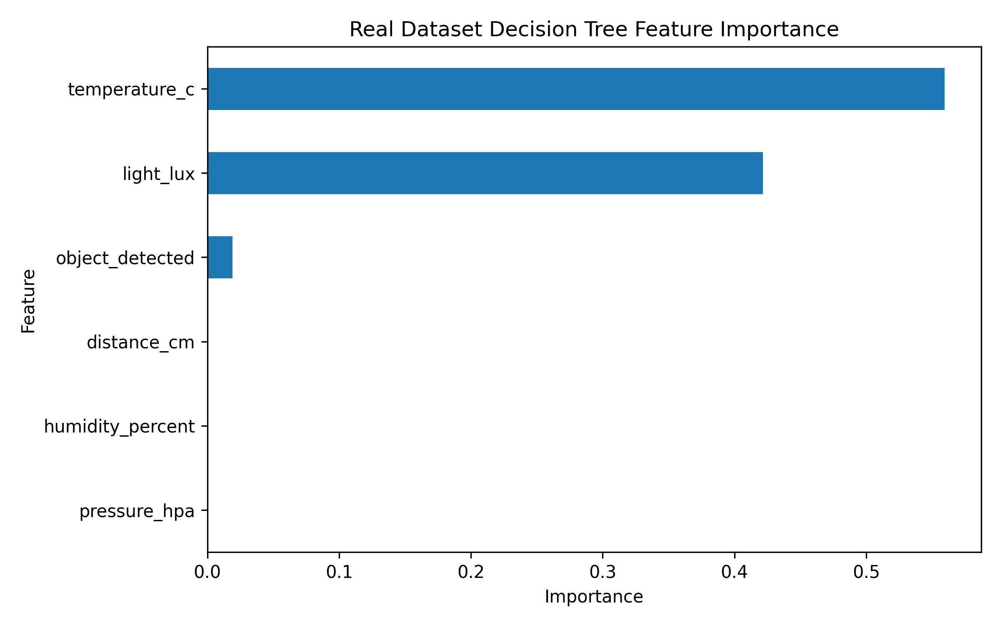
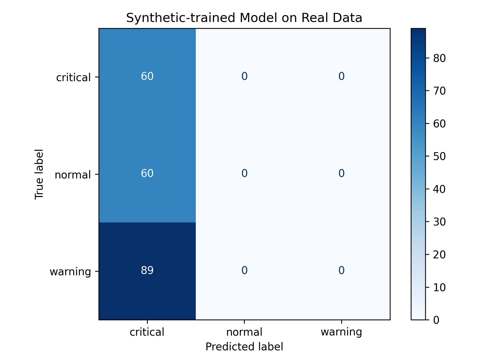
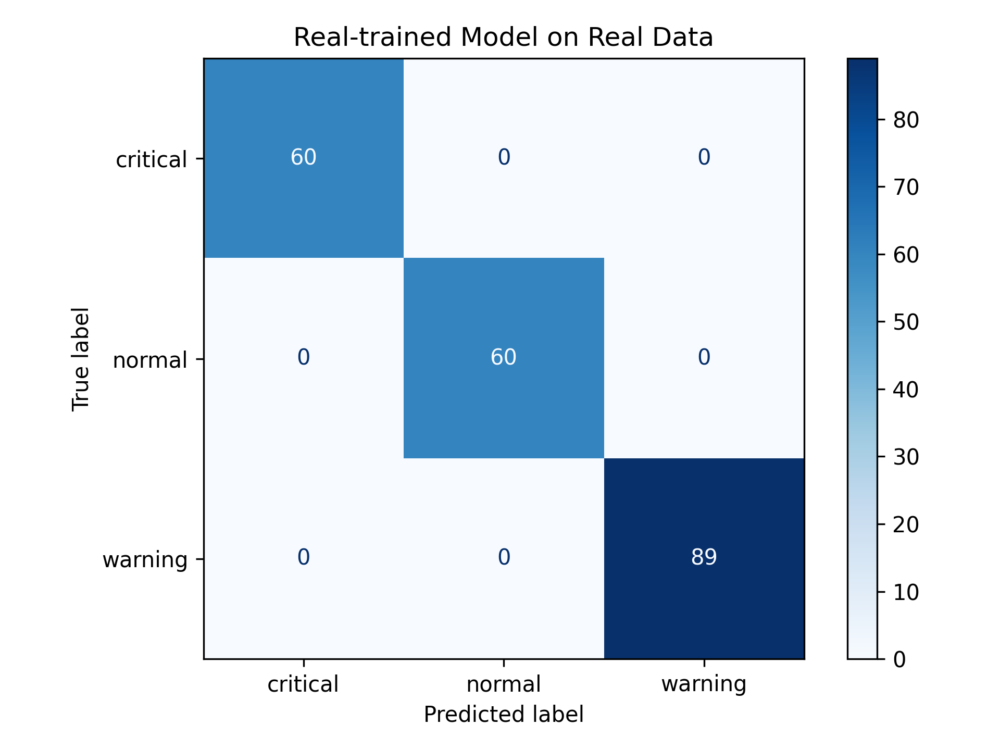

# TinyML Flight Condition Monitor

Aerospace-inspired embedded machine learning system for monitoring environmental and proximity conditions using ESP32 sensors and lightweight classification.

This project demonstrates a complete TinyML-style workflow:

`synthetic sensor data generation → model training → evaluation → decision rule export → ESP32 sensor logging → real sensor dataset collection → real model training → synthetic-vs-real model comparison → filtered Round2 real dataset → embedded-friendly decision rules → ESP32 embedded inference → OLED / NeoPixel / buzzer hardware feedback`

The goal is not to build a real aircraft safety system. Instead, this project is an educational embedded AI prototype inspired by aerospace-style condition monitoring and onboard environmental sensing.

---

## Project Overview

This project classifies sensor-based conditions into three states:

- `normal`
- `warning`
- `critical`

The system is designed around an ESP32-based embedded sensor node. The current implementation includes:

- a synthetic machine learning pipeline
- real sensor data logging from ESP32 hardware
- scenario-based real dataset collection
- real-data model training
- comparison between synthetic-trained and real-trained models
- a larger filtered Round2 real dataset
- an embedded-friendly decision tree model trained on real sensor data
- exported decision rules for ESP32 deployment
- ESP32 firmware inference using embedded threshold logic
- live Serial output with predicted condition
- NeoPixel visual status output
- OLED live condition display
- buzzer alert for critical conditions

Input features:

- `temperature_c`
- `pressure_hpa`
- `humidity_percent`
- `light_lux`
- `distance_cm`
- `object_detected`

The main machine learning model is a lightweight `DecisionTreeClassifier`, selected because it is interpretable, suitable for small embedded datasets, and easier to convert into embedded rule-based logic for ESP32 deployment.

For the final firmware demo, the learned decision-tree thresholds are converted into safety-prioritized embedded `if-else` logic. Proximity-based critical conditions are prioritized in firmware to make the embedded behavior more robust during real hardware testing.

---

## Motivation

Embedded monitoring systems often need to make decisions directly on low-power hardware. Instead of relying on a large cloud-based model, this project explores a small and explainable ML pipeline that can run directly on an ESP32.

The project focuses on:

- TinyML
- embedded AI
- sensor-based condition monitoring
- cyber-physical systems
- interpretable machine learning
- aerospace-inspired environmental monitoring
- edge intelligence on microcontrollers
- real-world validation of sensor-based ML models
- converting trained decision rules into embedded firmware logic
- hardware feedback using OLED, NeoPixel LEDs, and buzzer alerts

---

## Hardware Target

The embedded target is an ESP32-based sensor node.

Hardware components used:

- ESP32
- BME280 temperature, pressure, and humidity sensor
- BH1750 light sensor
- VL53LDK / VL53L0X-compatible Time-of-Flight distance sensor
- OLED display
- NeoPixel LEDs
- buzzer

The current hardware stage includes real sensor logging, embedded inference, live OLED display output, NeoPixel status colors, and buzzer alerts.

The firmware reads sensor data over I2C, predicts the current condition on-device, prints the result over Serial, displays the condition on OLED, updates NeoPixel colors, and activates the buzzer for critical conditions.

---

## Condition Classes

### Normal

Stable environmental conditions and no nearby object detected.

Typical pattern:

- moderate temperature
- stable atmospheric pressure
- moderate humidity
- normal ambient light
- no object detected in short range

### Warning

Moderately abnormal condition or medium-range proximity event.

Example patterns:

- object detected at medium short range
- low light condition
- warm and humid condition

### Critical

Severe abnormal condition or close proximity event.

Example patterns:

- object detected very close to the sensor
- very low light or dark condition

---

## Synthetic Machine Learning Pipeline

The initial ML pipeline uses synthetic sensor data generated from rule-based thresholds.

Pipeline steps:

1. Generate synthetic sensor data
2. Train a decision tree classifier
3. Evaluate the trained model
4. Generate a confusion matrix
5. Generate feature importance plot
6. Export the trained decision tree as readable rules

Run the full synthetic ML pipeline:

`python ml/main.py`

Individual scripts:

`python ml/generate_synthetic_data.py`

`python ml/train_model.py`

`python ml/evaluate_model.py`

`python ml/export_rules.py`

---

## Synthetic Dataset

Synthetic dataset file:

`data/synthetic_sensor_data.csv`

Features:

- `temperature_c`
- `pressure_hpa`
- `humidity_percent`
- `light_lux`
- `distance_cm`
- `object_detected`

Target:

- `label`

The synthetic dataset is used to prototype the full ML workflow before using real sensor data.

---

## Synthetic Model Results

Generated synthetic result files:

- `results/confusion_matrix.png`
- `results/feature_importance.png`
- `results/tree_rules.txt`

### Confusion Matrix


### Feature Importance


---

## Decision Rule Export

The trained synthetic decision tree is exported as readable rules:

`results/tree_rules.txt`

This is important because the model can later be converted into embedded `if-else` logic for ESP32 inference.

---

## ESP32 Sensor Logger and Embedded Inference Firmware

The project includes Arduino firmware for reading real sensor values from the ESP32 hardware prototype and performing embedded inference.

Firmware file:

`firmware/sensor_logger/sensor_logger.ino`

The firmware reads:

- temperature, pressure, and humidity from BME280
- light intensity from BH1750
- short-range distance from the VL53LDK / VL53L0X-compatible distance sensor

The ESP32 sends CSV-formatted readings over Serial, including the predicted condition.

Example Serial output:

`temperature_c,pressure_hpa,humidity_percent,light_lux,distance_cm,object_detected,predicted_condition`

Example row:

`27.14,840.60,15.87,155.00,6.20,1,critical`

The firmware also provides real-time hardware feedback:

- OLED display shows the current condition and live sensor values
- NeoPixel LEDs show condition status using color
- buzzer activates for critical conditions

---

## Embedded Hardware Feedback

The deployed ESP32 firmware maps predicted conditions to physical outputs.

### Serial Output

The ESP32 prints live sensor readings and the predicted condition over Serial.

Output columns:

- `temperature_c`
- `pressure_hpa`
- `humidity_percent`
- `light_lux`
- `distance_cm`
- `object_detected`
- `predicted_condition`

### OLED Display

The OLED display shows the live condition and key sensor values.

Displayed information includes:

- predicted condition
- light intensity
- distance
- humidity
- object detection flag

Example display content:

`NORMAL`, `WARNING`, or `CRITICAL`

### NeoPixel Status LEDs

NeoPixel LEDs provide a simple visual status indicator:

- `normal` → green
- `warning` → yellow/orange
- `critical` → red

### Buzzer Alert

The buzzer is used as an audible alert for critical conditions.

Behavior:

- `normal` → buzzer off
- `warning` → buzzer off
- `critical` → short beep alert

This creates a complete embedded feedback loop:

`sensor readings → ESP32 inference → Serial output → OLED display → NeoPixel status → buzzer alert`

---

## Real Sensor Data Collection

In addition to the synthetic dataset, this project includes real sensor data collected from the ESP32-based hardware prototype.

The ESP32 reads data from the connected sensors and sends CSV-formatted readings over Serial. A Python logging script stores these readings as CSV files for later analysis and model development.

Serial data logging script:

`ml/log_serial_data.py`

Example command:

`python ml/log_serial_data.py --port /dev/ttyUSB0 --samples 30 --output data/real_normal_baseline_log.csv`

---

## Initial Real Dataset Scenarios

The first real sensor logs were collected under separate controlled scenarios. Each scenario was saved as an individual CSV file before being combined into a labeled dataset.

Initial collected real scenarios:

- `real_normal_baseline_log.csv`
- `real_warning_distance_log.csv`
- `real_critical_close_distance_log.csv`
- `real_warning_low_light_log.csv`
- `real_critical_dark_log.csv`
- `real_bright_light_log.csv`
- `real_warm_humid_log.csv`

The scenario files are combined using:

`ml/build_real_dataset.py`

Output labeled dataset:

`data/real_labeled_sensor_data.csv`

The final real dataset includes:

- `timestamp`
- `temperature_c`
- `pressure_hpa`
- `humidity_percent`
- `light_lux`
- `distance_cm`
- `object_detected`
- `label`
- `scenario`

The `label` column represents the condition class:

- `normal`
- `warning`
- `critical`

The `scenario` column describes how the data was collected, such as `warning_distance`, `critical_dark`, or `warm_humid`.

---

## Real Dataset Analysis

The initial real dataset is analyzed using:

`ml/analyze_real_dataset.py`

This script generates plots for label distribution, scenario distribution, and mean feature values by label.

Generated real-data result files:

- `results/real_label_distribution.png`
- `results/real_scenario_distribution.png`
- `results/real_feature_ranges.png`

### Real Label Distribution


### Real Scenario Distribution


### Real Feature Ranges


---

## Real Model Results

A separate decision tree model was trained on the initial labeled real sensor dataset.

Training script:

`ml/train_real_model.py`

Trained model file:

`models/real_decision_tree_model.joblib`

Evaluation script:

`ml/evaluate_real_model.py`

Generated real-model result files:

- `results/real_confusion_matrix_model.png`
- `results/real_model_feature_importance.png`

### Real Model Confusion Matrix


### Real Model Feature Importance



The initial real-data model achieves perfect classification on the collected controlled scenario dataset. This result should be interpreted carefully because the dataset is small and scenario-based. It shows that the decision tree can separate the collected prototype conditions, but larger and more diverse real datasets are needed for more reliable model behavior.

---

## Synthetic vs Real Model Comparison

To understand how well the synthetic pipeline transfers to real hardware data, both trained models were evaluated on the labeled real sensor dataset.

Comparison script:

`ml/compare_synthetic_real_models.py`

Generated comparison result files:

- `results/synthetic_model_on_real_confusion_matrix.png`
- `results/real_model_on_real_confusion_matrix.png`

### Synthetic-Trained Model on Real Data



### Real-Trained Model on Real Data



### Comparison Summary

- Synthetic-trained model accuracy on real data: `0.2871`
- Real-trained model accuracy on real data: `1.0000`

This comparison shows that the synthetic dataset was useful for building and testing the initial ML pipeline, but it does not fully match the distribution of the real sensor data collected from the ESP32 hardware prototype.

The real-trained model performs much better on the collected real dataset, which highlights the importance of real-world data collection for embedded ML validation and deployment.

This is an important result for the project: the synthetic data helped build the pipeline, but the real hardware data was necessary for realistic model behavior.

---

## Round2 Real Dataset

To improve the reliability of the real-data workflow, a second round of real sensor data was collected under more controlled and diverse conditions.

The Round2 dataset was collected in the same room and within a short time window to reduce environmental drift between scenarios. Each scenario was saved as a separate CSV file and then filtered before being merged into a labeled dataset.

Round2 scenario files:

- `data/real_normal_baseline_round2_log.csv`
- `data/real_normal_bright_light_round2_log.csv`
- `data/real_normal_medium_light_round2_log.csv`
- `data/real_warning_low_light_round2_log.csv`
- `data/real_critical_dark_round2_log.csv`
- `data/real_warning_distance_round2_log.csv`
- `data/real_critical_close_distance_round2_log.csv`
- `data/real_warning_warm_humid_round2_log.csv`
- `data/real_warning_warm_humid_high_light_round2_log.csv`

The Round2 dataset is built using:

`ml/build_real_dataset_round2.py`

Output dataset:

`data/real_labeled_sensor_data_round2.csv`

The Round2 build script applies scenario-specific filters before merging the files. For example:

- warning-distance samples keep rows with detected objects in the 30–50 cm range
- critical close-distance samples keep rows with detected objects below 30 cm
- dark critical samples keep rows with very low light values
- warm/humid warning samples keep rows with high humidity and no nearby object
- normal medium-light samples help distinguish normal lighting from warm/humid warning conditions

Round2 final label distribution:

- `normal`: 607 samples
- `warning`: 798 samples
- `critical`: 406 samples

Total Round2 samples:

`1811`

This dataset is more suitable for embedded model development than the initial small real dataset because it contains more samples, cleaner scenario separation, and additional corrective data for medium-light and high-humidity cases.

---

## Embedded-Friendly Round2 Model

A second embedded-friendly decision tree model was trained on the filtered Round2 real dataset.

Training script:

`ml/train_real_embedded_model_round2.py`

Model file:

`models/real_embedded_decision_tree_model_round2.joblib`

The embedded-friendly model uses only the following features:

- `humidity_percent`
- `light_lux`
- `distance_cm`
- `object_detected`

These features were selected because they map directly to simple embedded inference logic and avoid relying too heavily on temperature or pressure drift.

Round2 embedded model performance:

- Accuracy: `0.9934`
- Critical recall: `1.00`
- Normal recall: `0.98`
- Warning recall: `1.00`

This result is more realistic than the earlier perfect-score models because the Round2 dataset includes more overlapping conditions, especially medium-light normal data and high-humidity warning data.

---

## Round2 Embedded Decision Rules

The Round2 embedded-friendly decision tree was exported as readable rules using:

`ml/export_real_embedded_rules_round2.py`

Generated rule file:

`results/real_embedded_tree_rules_round2.txt`

Exported rules:

```text
|--- light_lux <= 76.25
|   |--- light_lux <= 10.00
|   |   |--- class: critical
|   |--- light_lux >  10.00
|   |   |--- distance_cm <= 28.75
|   |   |   |--- class: critical
|   |   |--- distance_cm >  28.75
|   |   |   |--- light_lux <= 73.75
|   |   |   |   |--- humidity_percent <= 20.01
|   |   |   |   |   |--- class: normal
|   |   |   |   |--- humidity_percent >  20.01
|   |   |   |   |   |--- class: warning
|   |   |   |--- light_lux >  73.75
|   |   |   |   |--- humidity_percent <= 28.95
|   |   |   |   |   |--- class: normal
|   |   |   |   |--- humidity_percent >  28.95
|   |   |   |   |   |--- class: warning
|--- light_lux >  76.25
|   |--- humidity_percent <= 29.51
|   |   |--- class: normal
|   |--- humidity_percent >  29.51
|   |   |--- class: warning
```

The exported rules were used as the basis for ESP32 firmware inference. During hardware testing, the firmware logic was adapted into a safety-prioritized version where proximity conditions are checked before light and humidity. This prevents close objects from being classified as normal under high-light conditions.

The final embedded logic follows this behavior:

- very close object detection triggers `critical`
- medium-range object detection triggers `warning`
- very low light triggers `critical`
- low light triggers `warning`
- high humidity triggers `warning`
- otherwise the condition remains `normal`

This makes the deployed ESP32 behavior more robust and more intuitive for a physical monitoring demo.

---

## Embedded Deployment Demo

The current firmware implements a complete embedded deployment demo on ESP32.

Firmware file:

`firmware/sensor_logger/sensor_logger.ino`

Implemented embedded features:

- sensor initialization over I2C
- BME280 environmental readings
- BH1750 light readings
- VL53L0X-compatible distance readings
- embedded condition inference
- Serial output with predicted condition
- OLED live status display
- NeoPixel condition colors
- buzzer alert for critical conditions

Condition output behavior:

| Condition | NeoPixel | OLED | Buzzer |
|---|---|---|---|
| `normal` | green | `NORMAL` | off |
| `warning` | yellow/orange | `WARNING` | off |
| `critical` | red | `CRITICAL` | beep alert |

The deployed embedded demo shows the full edge-AI workflow: the ESP32 reads sensors, performs local inference, and provides immediate visual and audible feedback without needing a cloud service.

---

## Current Real Data Status

The project now contains two real-data stages.

### Initial Real Dataset

The first real dataset was small and intended for early prototype validation. It covered:

- normal baseline condition
- medium-distance proximity warning
- close-distance critical condition
- low-light warning condition
- dark critical condition
- bright light observation
- warm and humid condition

### Round2 Real Dataset

The Round2 dataset is larger, filtered, and more suitable for embedded model development. It covers:

- normal baseline condition
- normal bright-light condition
- normal medium-light condition
- low-light warning condition
- dark critical condition
- medium-distance proximity warning
- close-distance critical condition
- warm and humid warning condition
- warm and humid high-light warning condition

The Round2 dataset is currently the preferred real dataset for embedded inference work.

---

## Repository Structure

- `data/` synthetic and real sensor datasets
- `docs/` project documentation
- `firmware/` ESP32 firmware
- `ml/` machine learning and data processing scripts
- `models/` trained model files
- `results/` plots, evaluation outputs, and exported rules
- `assets/` additional project assets

---

## Setup

Create and activate a virtual environment:

`python3 -m venv venv`

`source venv/bin/activate`

Install dependencies:

`pip install -r requirements.txt`

Run the full synthetic ML pipeline:

`python ml/main.py`

Build the initial labeled real dataset:

`python ml/build_real_dataset.py`

Analyze the initial real dataset:

`python ml/analyze_real_dataset.py`

Train the initial real-data decision tree model:

`python ml/train_real_model.py`

Evaluate the initial real-data decision tree model:

`python ml/evaluate_real_model.py`

Compare synthetic-trained and real-trained models on real data:

`python ml/compare_synthetic_real_models.py`

Build the filtered Round2 real dataset:

`python ml/build_real_dataset_round2.py`

Train the embedded-friendly Round2 model:

`python ml/train_real_embedded_model_round2.py`

Export the Round2 embedded decision rules:

`python ml/export_real_embedded_rules_round2.py`

View the exported Round2 rules:

`cat results/real_embedded_tree_rules_round2.txt`

---

## Firmware Setup

The ESP32 firmware is located at:

`firmware/sensor_logger/sensor_logger.ino`

Required Arduino libraries:

- `Adafruit BME280 Library`
- `Adafruit Unified Sensor`
- `BH1750`
- `Adafruit VL53L0X`
- `Adafruit NeoPixel`
- `Adafruit GFX Library`
- `Adafruit SSD1306`

Default hardware pins:

- I2C SDA: GPIO 21
- I2C SCL: GPIO 22
- NeoPixel data pin: GPIO 27
- Buzzer pin: GPIO 23
- OLED I2C address: `0x3C`

Upload the firmware using Arduino IDE or a compatible ESP32 upload workflow.

---

## Current Status

Completed:

- project structure
- synthetic data generator
- synthetic decision tree training pipeline
- synthetic model saving
- synthetic evaluation plots
- feature importance analysis
- decision rule export
- ESP32 I2C sensor logger firmware
- real sensor serial logging script
- scenario-based real sensor logs
- initial labeled real sensor dataset
- real dataset analysis plots
- real decision tree model training
- real model evaluation plots
- synthetic-trained vs real-trained model comparison
- filtered Round2 real sensor dataset
- embedded-friendly Round2 decision tree model
- exported Round2 embedded decision rules
- ESP32 embedded inference logic
- Serial output with predicted condition
- NeoPixel status output
- OLED live condition display
- buzzer critical alert

Next steps:

- add photos or demo GIFs of the hardware prototype
- document the wiring diagram
- optionally add a small neural network baseline for comparison
- optionally test the embedded logic in different rooms and lighting conditions
- optionally create a short project report or portfolio case study

---

## Notes on Neural Networks

A neural network is not used as the main model in the current version because the project benefits more from an interpretable embedded model.

A small `MLPClassifier` may be added later as an experimental baseline for comparison after the real-data pipeline is stable. However, the decision tree remains the preferred embedded model because it is interpretable, lightweight, and easier to deploy on ESP32 as rule-based logic.

For this stage, the priority is reliable embedded inference and hardware feedback using OLED, NeoPixel LEDs, and buzzer alerts.

---

## Limitations

The synthetic dataset is generated using manually designed threshold rules.

The initial real dataset is small and collected under manually controlled scenarios. It is useful for prototype validation, but should not be treated as robust real-world coverage.

The Round2 real dataset is larger and cleaner, but it is still collected in one room under manually controlled conditions. More data from different environments would be needed for general real-world reliability.

The real-data models perform very well on the collected controlled scenario datasets, but this should not be interpreted as proof of general real-world reliability.

The synthetic-trained model performs poorly on the collected real dataset, showing that the synthetic distribution does not fully match real sensor behavior. This is a useful validation result and motivates real-world data collection.

The final ESP32 firmware uses safety-prioritized embedded threshold logic derived from the learned decision tree rules. This makes the hardware behavior more robust, but it should still be interpreted as an educational prototype rather than a certified safety system.

This project should not be interpreted as a real aircraft monitoring, navigation, or safety system. It is an educational embedded AI prototype inspired by aerospace condition monitoring concepts.

---

## License

This project is released under the MIT License.
