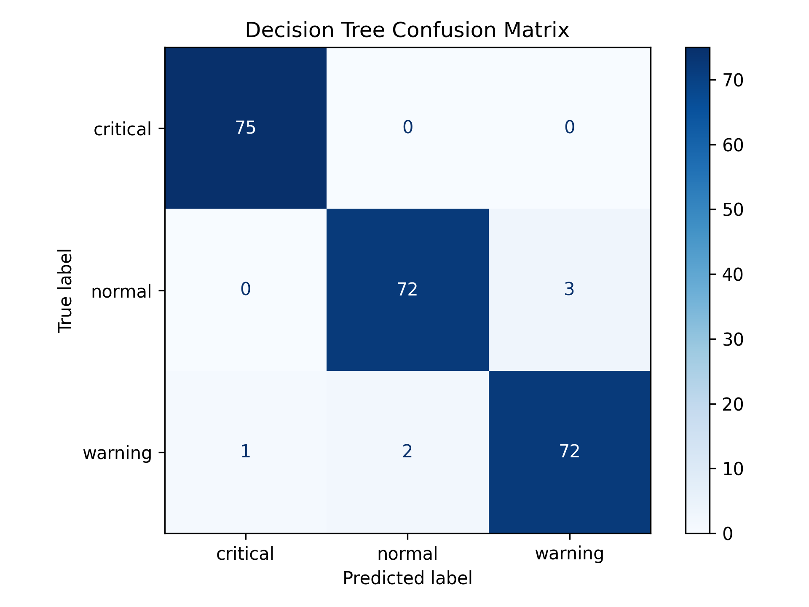
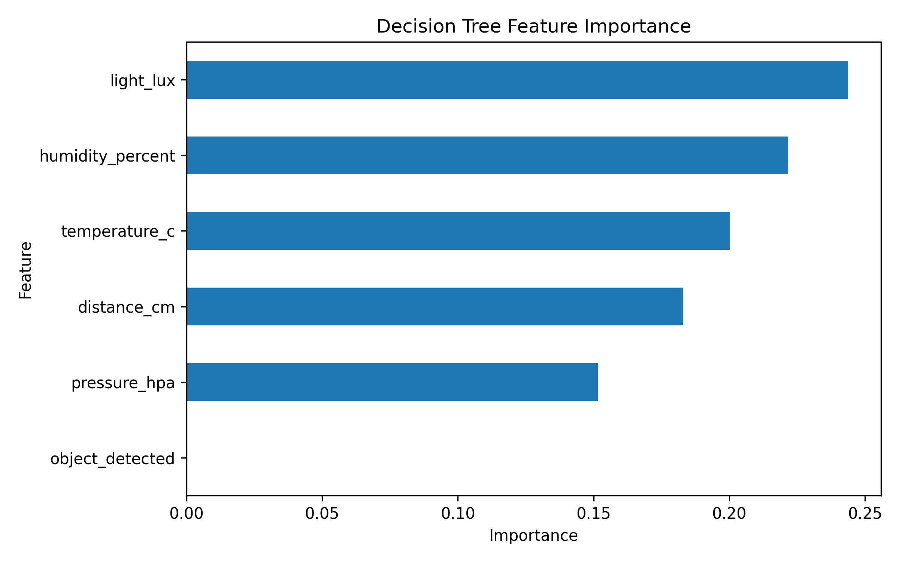
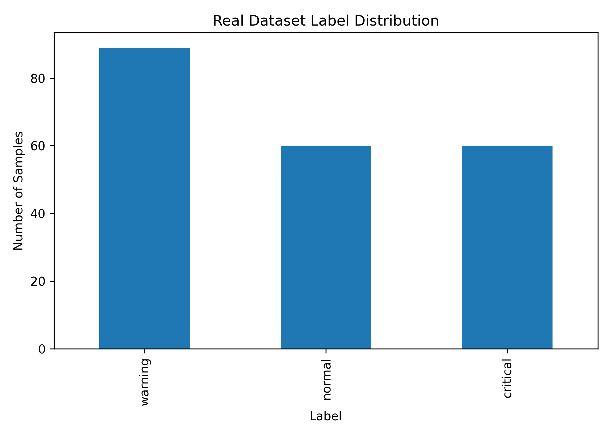
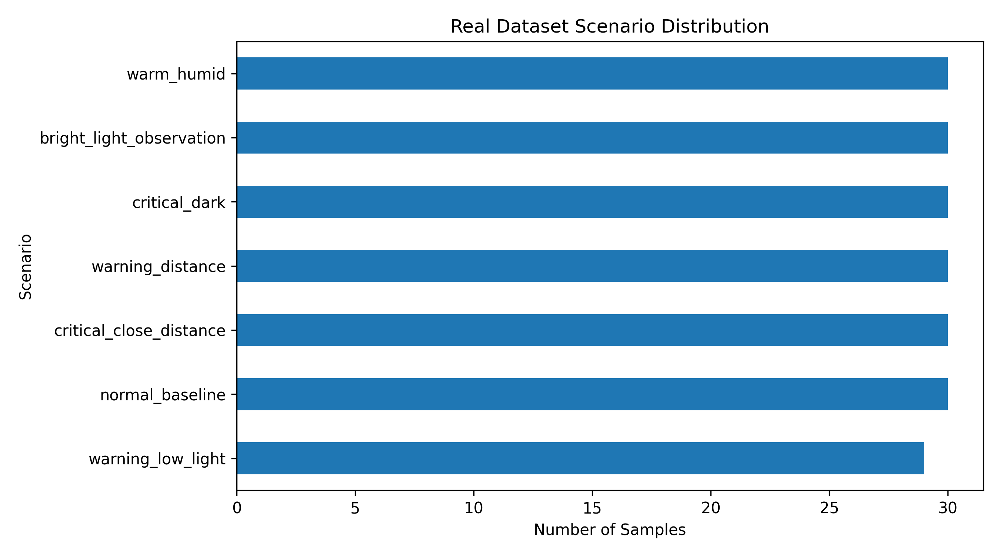
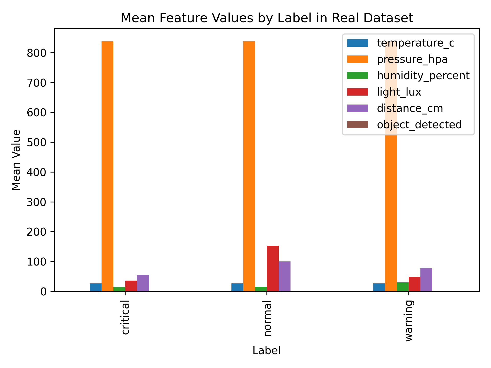

# TinyML Flight Condition Monitor

Aerospace-inspired embedded machine learning system for monitoring environmental and proximity conditions using ESP32 sensors and lightweight classification.

This project demonstrates a complete TinyML-style workflow:

`synthetic sensor data generation → model training → evaluation → decision rule export → ESP32 sensor logging → real sensor dataset collection`

The goal is not to build a real aircraft safety system. Instead, this project is an educational embedded AI prototype inspired by aerospace-style condition monitoring and onboard environmental sensing.

---

## Project Overview

This project classifies sensor-based conditions into three states:

- `normal`
- `warning`
- `critical`

The system is designed around an ESP32-based embedded sensor node. The current implementation includes both a synthetic ML pipeline and real sensor data collection from hardware.

Input features:

- `temperature_c`
- `pressure_hpa`
- `humidity_percent`
- `light_lux`
- `distance_cm`
- `object_detected`

The current machine learning model is a lightweight `DecisionTreeClassifier`, selected because it is interpretable and suitable for later embedded deployment as rule-based logic.

---

## Motivation

Embedded monitoring systems often need to make decisions directly on low-power hardware. Instead of relying on a large cloud-based model, this project explores a small and explainable ML pipeline that can eventually be deployed on an ESP32.

The project focuses on:

- TinyML
- embedded AI
- sensor-based condition monitoring
- cyber-physical systems
- interpretable machine learning
- aerospace-inspired environmental monitoring
- edge intelligence on microcontrollers

---

## Hardware Target

The planned embedded target is an ESP32-based sensor node.

Hardware components used or planned:

- ESP32
- BME280 temperature, pressure, and humidity sensor
- BH1750 light sensor
- VL53LDK / VL53L0X-compatible Time-of-Flight distance sensor
- OLED display
- NeoPixel LEDs
- buzzer

The current hardware stage includes real sensor logging over Serial using BME280, BH1750, and the VL53LDK / VL53L0X-compatible distance sensor.

---

## Condition Classes

### Normal

Stable environmental conditions and no nearby object detected.

Typical pattern:

- moderate temperature
- stable atmospheric pressure
- moderate humidity
- normal ambient light
- no object detected in short range

### Warning

Moderately abnormal condition or medium-range proximity event.

Example patterns:

- object detected at medium short range
- low light condition
- warm and humid condition

### Critical

Severe abnormal condition or close proximity event.

Example patterns:

- object detected very close to the sensor
- very low light / dark condition

---

## Synthetic Machine Learning Pipeline

The initial ML pipeline uses synthetic sensor data generated from rule-based thresholds.

Pipeline steps:

1. Generate synthetic sensor data
2. Train a decision tree classifier
3. Evaluate the trained model
4. Generate a confusion matrix
5. Generate feature importance plot
6. Export the trained decision tree as readable rules

Run the full synthetic ML pipeline:

`python ml/main.py`

Individual scripts:

`python ml/generate_synthetic_data.py`

`python ml/train_model.py`

`python ml/evaluate_model.py`

`python ml/export_rules.py`

---

## Synthetic Dataset

Synthetic dataset file:

`data/synthetic_sensor_data.csv`

Features:

- `temperature_c`
- `pressure_hpa`
- `humidity_percent`
- `light_lux`
- `distance_cm`
- `object_detected`

Target:

- `label`

The synthetic dataset is used to prototype the full ML workflow before using real sensor data.

---

## Synthetic Model Results

Generated synthetic result files:

- `results/confusion_matrix.png`
- `results/feature_importance.png`
- `results/tree_rules.txt`

### Confusion Matrix

### Feature Importance

---

## Decision Rule Export

The trained decision tree is exported as readable rules:

`results/tree_rules.txt`

This is important because the model can later be converted into embedded `if-else` logic for ESP32 inference.

---

## ESP32 Sensor Logger

The project includes Arduino firmware for reading real sensor values from the ESP32 hardware prototype.

Firmware file:

`firmware/sensor_logger/sensor_logger.ino`

The firmware reads:

- temperature, pressure, and humidity from BME280
- light intensity from BH1750
- short-range distance from the VL53LDK / VL53L0X-compatible distance sensor

The ESP32 sends CSV-formatted readings over Serial.

Example Serial output:

`temperature_c,pressure_hpa,humidity_percent,light_lux,distance_cm,object_detected`

---

## Real Sensor Data Collection

In addition to the synthetic dataset, this project includes real sensor data collected from the ESP32-based hardware prototype.

The ESP32 reads data from the connected sensors and sends CSV-formatted readings over Serial. A Python logging script stores these readings as CSV files for later analysis and model development.

Serial data logging script:

`ml/log_serial_data.py`

Example command:

`python ml/log_serial_data.py --port /dev/ttyUSB0 --samples 30 --output data/real_normal_baseline_log.csv`

---

## Real Dataset Scenarios

Real sensor logs were collected under separate controlled scenarios. Each scenario was saved as an individual CSV file before being combined into a labeled dataset.

Collected real scenarios:

- `real_normal_baseline_log.csv`
- `real_warning_distance_log.csv`
- `real_critical_close_distance_log.csv`
- `real_warning_low_light_log.csv`
- `real_critical_dark_log.csv`
- `real_bright_light_log.csv`
- `real_warm_humid_log.csv`

The scenario files are combined using:

`ml/build_real_dataset.py`

Output labeled dataset:

`data/real_labeled_sensor_data.csv`

The final real dataset includes:

- `timestamp`
- `temperature_c`
- `pressure_hpa`
- `humidity_percent`
- `light_lux`
- `distance_cm`
- `object_detected`
- `label`
- `scenario`

The `label` column represents the condition class:

- `normal`
- `warning`
- `critical`

The `scenario` column describes how the data was collected, such as `warning_distance`, `critical_dark`, or `warm_humid`.

---

## Real Dataset Analysis

The real dataset is analyzed using:

`ml/analyze_real_dataset.py`

This script generates plots for label distribution, scenario distribution, and mean feature values by label.

Generated real-data result files:

- `results/real_label_distribution.png`
- `results/real_scenario_distribution.png`
- `results/real_feature_ranges.png`

### Real Label Distribution

### Real Scenario Distribution

### Real Feature Ranges

---

## Current Real Data Status

The current real dataset contains sensor readings collected from the ESP32 prototype using:

- BME280 for temperature, pressure, and humidity
- BH1750 for light intensity
- VL53LDK / VL53L0X-compatible Time-of-Flight distance sensor

The real data currently covers:

- normal baseline condition
- medium-distance proximity warning
- close-distance critical condition
- low-light warning condition
- dark critical condition
- bright light observation
- warm and humid condition

This real dataset is still small and intended for prototype validation. Larger real datasets can be collected later for more reliable model training.

---

## Repository Structure

- `data/` synthetic and real sensor datasets
- `docs/` project documentation
- `firmware/` ESP32 firmware
- `ml/` machine learning and data processing scripts
- `models/` trained model files
- `results/` plots, evaluation outputs, and exported rules
- `assets/` additional project assets

---

## Setup

Create and activate a virtual environment:

`python3 -m venv venv`

`source venv/bin/activate`

Install dependencies:

`pip install -r requirements.txt`

Run the full synthetic ML pipeline:

`python ml/main.py`

Build the labeled real dataset:

`python ml/build_real_dataset.py`

Analyze the real dataset:

`python ml/analyze_real_dataset.py`

---

## Current Status

Completed:

- project structure
- synthetic data generator
- decision tree training pipeline
- model saving
- synthetic evaluation plots
- feature importance analysis
- decision rule export
- ESP32 I2C sensor logger firmware
- real sensor serial logging script
- scenario-based real sensor logs
- labeled real sensor dataset
- real dataset analysis plots

Next steps:

- train and evaluate a model on the real labeled dataset
- compare synthetic-trained and real-trained model behavior
- convert decision rules into embedded inference logic
- show predicted condition on OLED, NeoPixels, and buzzer

---

## Limitations

The synthetic dataset is generated using manually designed threshold rules.

The real dataset is currently small and collected under manually controlled scenarios. It is useful for prototype validation, but larger and more diverse real datasets would be needed for robust model training.

This project should not be interpreted as a real aircraft monitoring, navigation, or safety system. It is an educational embedded AI prototype inspired by aerospace condition monitoring concepts.

---

## License

This project is released under the MIT License.
