# TinyML Embedded Condition Monitor

Embedded machine learning prototype for monitoring environmental and proximity conditions using ESP32 sensors and lightweight classification.

The repository covers a complete TinyML-style workflow:

`synthetic sensor data generation → model training → evaluation → decision rule export → ESP32 sensor logging → real sensor dataset collection → real model training → synthetic-vs-real comparison → filtered Round2 real dataset → embedded-friendly decision rules → ESP32 embedded inference → OLED / NeoPixel / buzzer hardware feedback`

The goal is not to build a real safety-critical system. Instead, this project is an educational embedded AI prototype for sensor-based condition monitoring on microcontroller hardware.

## Project Highlights

- Built a complete sensor-to-deployment TinyML-style workflow
- Collected real ESP32 sensor logs in multiple controlled scenarios
- Compared synthetic-data and real-data model behavior
- Trained an embedded-friendly decision tree on real sensor data
- Adapted learned thresholds and controlled scenario boundaries into ESP32 `if-else` condition logic
- Added live OLED, NeoPixel, and buzzer feedback for physical status output
- Documented hardware setup, embedded inference logic, photos, and demo video

---


## Project Overview

This project classifies sensor-based conditions into three states:

- `normal`
- `warning`
- `critical`

The system is designed around an ESP32-based embedded sensor node. The current implementation includes:

- synthetic sensor data generation
- synthetic decision tree training and evaluation
- real ESP32 sensor logging
- scenario-based real dataset collection
- real-data model training
- synthetic-vs-real model comparison
- a larger filtered Round2 real dataset
- an embedded-friendly decision tree model trained on real sensor data
- exported decision rules for ESP32 deployment
- ESP32 firmware inference using embedded threshold logic
- live Serial output with predicted condition and cause
- OLED live status and cause display
- NeoPixel visual status output
- buzzer alert for critical conditions
- hardware demo photos
- project documentation for system overview and hardware setup

Input features:

- `temperature_c`
- `pressure_hpa`
- `humidity_percent`
- `light_lux`
- `distance_cm`
- `object_detected`

The main machine learning model is a lightweight `DecisionTreeClassifier`, selected because it is interpretable, suitable for small embedded datasets, and easier to convert into embedded rule-based logic for ESP32 deployment.

The final firmware is not a line-by-line deployment of the trained Decision Tree. It uses manually adapted threshold logic informed by the Round2 model and the controlled scenario definitions, with proximity checks intentionally evaluated before light and humidity.

---

## Motivation

Embedded monitoring systems often need to make decisions directly on low-power hardware. Instead of relying on a large cloud-based model, this project explores a small and explainable ML pipeline that can run directly on an ESP32.

The project focuses on:

- TinyML
- embedded AI
- sensor-based condition monitoring
- cyber-physical systems
- interpretable machine learning
- embedded environmental and proximity monitoring
- edge intelligence on microcontrollers
- controlled evaluation of sensor-based ML models
- converting trained decision rules into embedded firmware logic
- hardware feedback using OLED, NeoPixel LEDs, and buzzer alerts

---

## Hardware Target

The embedded target is an ESP32-based sensor node.

Hardware components used:

- ESP32
- BME280 temperature, pressure, and humidity sensor
- BH1750 light sensor
- VL53L0X-compatible Time-of-Flight distance sensor
- OLED display
- NeoPixel LEDs
- buzzer

The current hardware stage includes real sensor logging, embedded inference, live OLED display output, NeoPixel status colors, and buzzer alerts.

The firmware reads sensor data over I2C, predicts the current condition on-device, prints the result over Serial, displays the condition and cause on OLED, updates NeoPixel colors, and activates the buzzer for critical conditions.

Detailed hardware wiring and setup notes are available in [`docs/hardware_setup.md`](docs/hardware_setup.md).

The relationship between the trained Decision Tree and the manually adapted ESP32 threshold logic is explained in [`docs/embedded_inference_explanation.md`](docs/embedded_inference_explanation.md).

---

## Condition Classes

### Normal

Stable environmental conditions and no nearby object detected.

Typical pattern:

- moderate temperature
- stable atmospheric pressure
- moderate humidity
- normal ambient light
- no object detected in short range

### Warning

Moderately abnormal condition or medium-range proximity event.

Example patterns:

- object detected at medium short range
- low light condition
- warm and humid condition

### Critical

Severe abnormal condition or close proximity event.

Example patterns:

- object detected very close to the sensor
- very low light or dark condition

---

## Hardware Demo Photos

### Full ESP32 Prototype

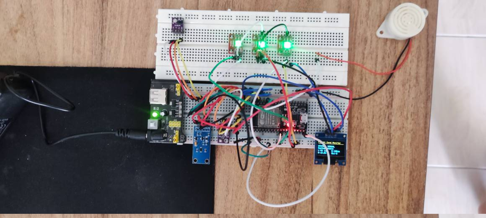

### OLED Normal Status

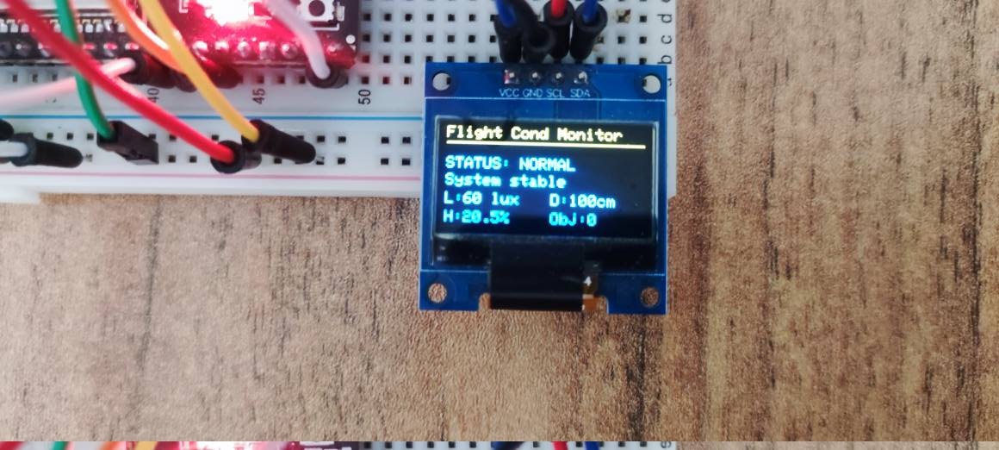

### OLED Warning Status

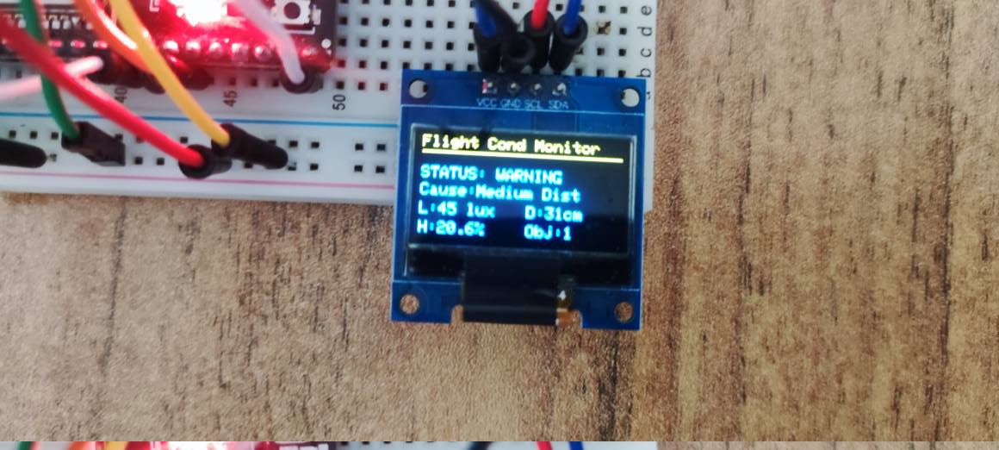

### OLED Critical Status

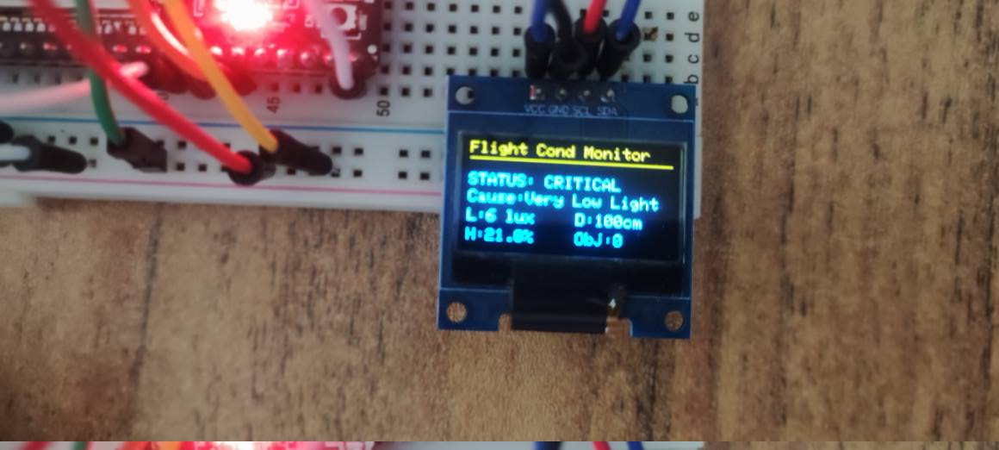

### NeoPixel Critical Alert

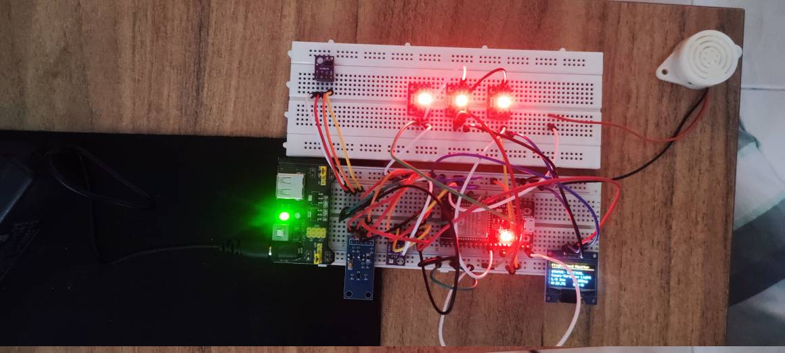

---

## Synthetic Machine Learning Pipeline

The initial ML pipeline uses synthetic sensor data generated from rule-based thresholds.

Pipeline steps:

1. Generate synthetic sensor data
2. Train a decision tree classifier
3. Evaluate the trained model
4. Generate a confusion matrix
5. Generate feature importance plot
6. Export the trained decision tree as readable rules

Run the full synthetic ML pipeline:

`python ml/main.py`

Individual scripts:

`python ml/generate_synthetic_data.py`

`python ml/train_model.py`

`python ml/evaluate_model.py`

`python ml/export_rules.py`

---

## Synthetic Dataset

Synthetic dataset file:

`data/synthetic_sensor_data.csv`

Features:

- `temperature_c`
- `pressure_hpa`
- `humidity_percent`
- `light_lux`
- `distance_cm`
- `object_detected`

Target:

- `label`

The synthetic dataset is used to prototype the full ML workflow before using real sensor data.

---

## Synthetic Model Results

Generated synthetic result files:

- `results/confusion_matrix.png`
- `results/feature_importance.png`
- `results/tree_rules.txt`

### Confusion Matrix

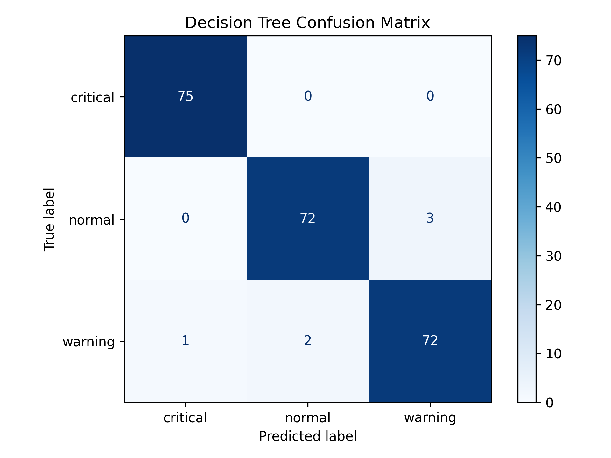

### Feature Importance

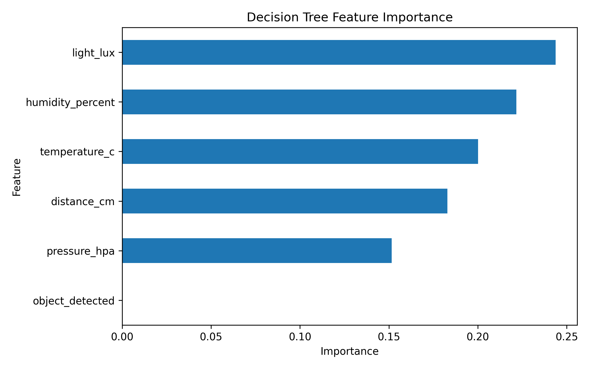

---

## Decision Rule Export

The trained synthetic decision tree is exported as readable rules:

`results/tree_rules.txt`

This is important because the model can later be converted into embedded `if-else` logic for ESP32 inference.

---

## ESP32 Sensor Logger and Embedded Inference Firmware

The project includes Arduino firmware for reading real sensor values from the ESP32 hardware prototype and performing embedded inference.

Firmware file:

`firmware/sensor_logger/sensor_logger.ino`

The firmware reads:

- temperature, pressure, and humidity from BME280
- light intensity from BH1750
- short-range distance from the VL53L0X-compatible distance sensor

The ESP32 sends CSV-formatted readings over Serial, including the predicted condition and prediction reason.

Example Serial output:

`temperature_c,pressure_hpa,humidity_percent,light_lux,distance_cm,object_detected,predicted_condition,prediction_reason`

Example row:

`27.14,840.60,15.87,155.00,6.20,1,critical,Close Object`

The firmware also provides real-time hardware feedback:

- OLED display shows the current condition, cause, and live sensor values
- NeoPixel LEDs show condition status using color
- buzzer activates for critical conditions

---

## Embedded Hardware Feedback

The deployed ESP32 firmware maps predicted conditions to physical outputs.

### Serial Output

The ESP32 prints live sensor readings, predicted condition, and prediction cause over Serial.

Output columns:

- `temperature_c`
- `pressure_hpa`
- `humidity_percent`
- `light_lux`
- `distance_cm`
- `object_detected`
- `predicted_condition`
- `prediction_reason`

### OLED Display

The OLED display shows the live condition, cause, and key sensor values.

Displayed information includes:

- predicted condition
- reason for warning or critical state
- light intensity
- distance
- humidity
- object detection flag

Example OLED states:

`STATUS: NORMAL`  
`System stable`

`STATUS: WARNING`  
`Cause:Low Light`

`STATUS: CRITICAL`  
`Cause:Close Object`

### NeoPixel Status LEDs

NeoPixel LEDs provide a simple visual status indicator:

- `normal` → green
- `warning` → yellow/orange
- `critical` → red

### Buzzer Alert

The buzzer is used as an audible alert for critical conditions.

Behavior:

- `normal` → buzzer off
- `warning` → buzzer off
- `critical` → short beep alert

This creates a complete embedded feedback loop:

`sensor readings → ESP32 inference → Serial output → OLED display → NeoPixel status → buzzer alert`

---

## Real Sensor Data Collection

In addition to the synthetic dataset, this project includes real sensor data collected from the ESP32-based hardware prototype.

The ESP32 reads data from the connected sensors and sends CSV-formatted readings over Serial. A Python logging script stores these readings as CSV files for later analysis and model development.

Serial data logging script:

`ml/log_serial_data.py`

Example command:

`python ml/log_serial_data.py --port /dev/ttyUSB0 --samples 30 --output data/real_normal_baseline_log.csv`

---

## Initial Real Dataset Scenarios

The first real sensor logs were collected under separate controlled scenarios. Each scenario was saved as an individual CSV file before being combined into a labeled dataset.

Initial collected real scenarios:

- `real_normal_baseline_log.csv`
- `real_warning_distance_log.csv`
- `real_critical_close_distance_log.csv`
- `real_warning_low_light_log.csv`
- `real_critical_dark_log.csv`
- `real_bright_light_log.csv`
- `real_warm_humid_log.csv`

The scenario files are combined using:

`ml/build_real_dataset.py`

Output labeled dataset:

`data/real_labeled_sensor_data.csv`

The final real dataset includes:

- `timestamp`
- `temperature_c`
- `pressure_hpa`
- `humidity_percent`
- `light_lux`
- `distance_cm`
- `object_detected`
- `label`
- `scenario`

The `label` column represents the condition class:

- `normal`
- `warning`
- `critical`

The `scenario` column describes how the data was collected, such as `warning_distance`, `critical_dark`, or `warm_humid`.

---

## Real Dataset Analysis

The initial real dataset is analyzed using:

`ml/analyze_real_dataset.py`

This script generates plots for label distribution, scenario distribution, and mean feature values by label.

Generated real-data result files:

- `results/real_label_distribution.png`
- `results/real_scenario_distribution.png`
- `results/real_feature_ranges.png`

### Real Label Distribution

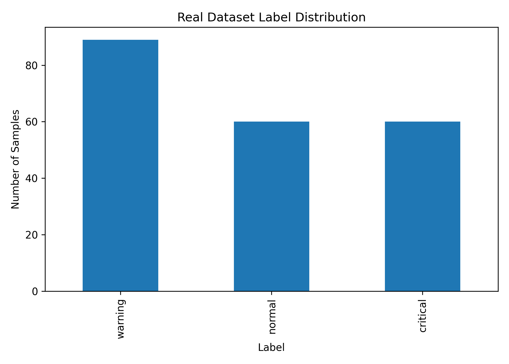

### Real Scenario Distribution

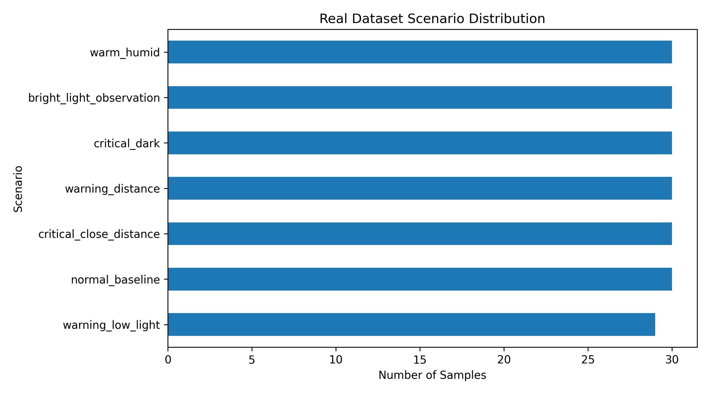

### Mean Feature Values by Label

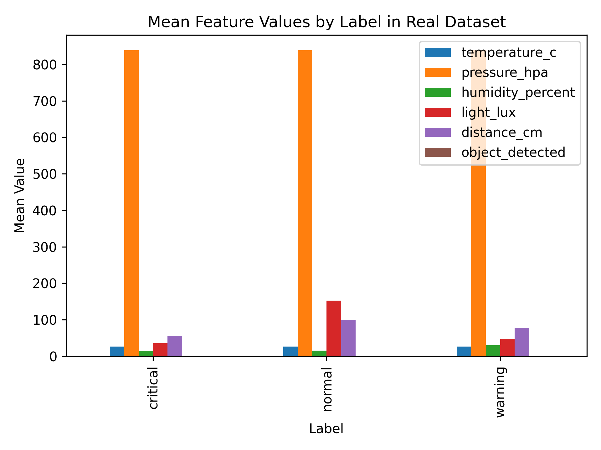

---

## Real Model Results

A separate decision tree model was trained on the initial labeled real sensor dataset.

Training script:

`ml/train_real_model.py`

Trained model file:

`models/real_decision_tree_model.joblib`

Evaluation script:

`ml/evaluate_real_model.py`

Generated real-model result files:

- `results/real_confusion_matrix_model.png`
- `results/real_model_feature_importance.png`

### Real Model Confusion Matrix

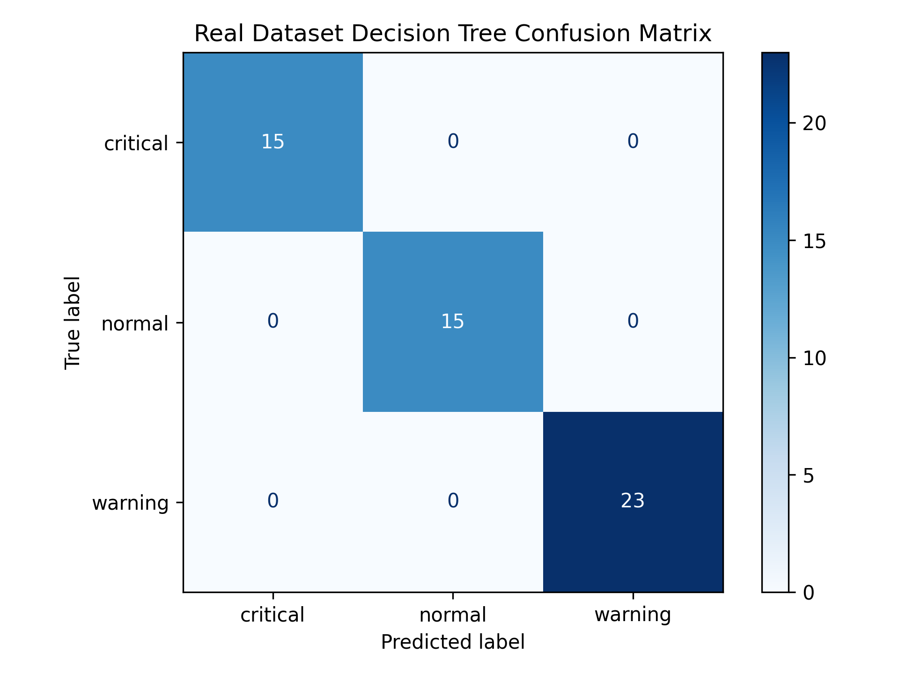

### Real Model Feature Importance

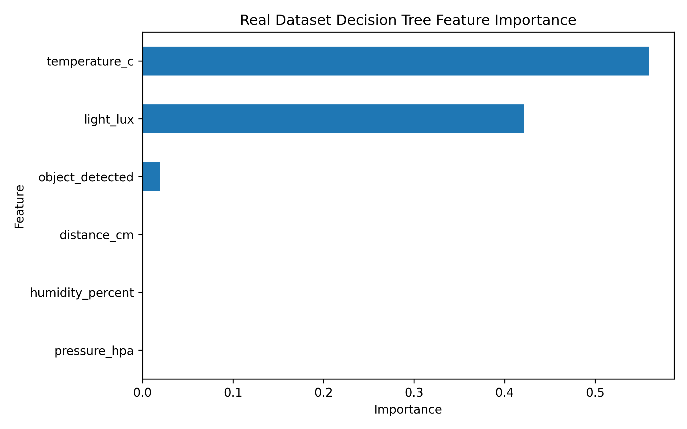

The initial real-data model achieves perfect classification on the collected controlled scenario dataset. This result should be interpreted carefully because the dataset is small and scenario-based. It shows that the decision tree can separate the collected prototype conditions, but larger and more diverse real datasets are needed for more reliable model behavior.

---

## Synthetic vs Real Model Comparison

Both the synthetic-trained and initial real-trained Decision Trees are evaluated on the same 25% stratified holdout reconstructed from `data/real_labeled_sensor_data.csv` using `random_state=42`.

Comparison script:

`ml/compare_synthetic_real_models.py`

Generated comparison result files:

- `results/synthetic_model_on_real_confusion_matrix.png`
- `results/real_model_on_real_confusion_matrix.png`

### Synthetic-Trained Model on Shared Real Holdout

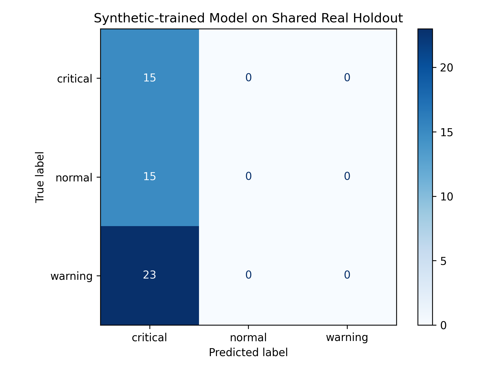

### Real-Trained Model on Shared Real Holdout

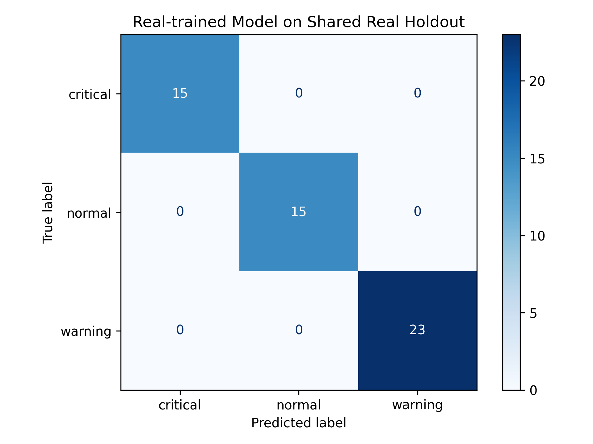

### Comparison Summary

- Evaluation samples: `53`
- Synthetic-trained model accuracy: `0.2830`
- Real-trained model accuracy: `1.0000`

The synthetic-trained model transfers poorly to this real-data holdout, showing a substantial mismatch between the synthetic distribution and the collected ESP32 sensor scenarios.

The real-trained score is a within-dataset holdout result. It should not be interpreted as independent recording-session or environment validation.

---

## Round2 Real Dataset

To improve the reliability of the real-data workflow, a second round of real sensor data was collected under more controlled and diverse conditions.

The Round2 dataset was collected in the same room and within a short time window to reduce environmental drift between scenarios. Each scenario was saved as a separate CSV file and then filtered before being merged into a labeled dataset.

Round2 scenario files:

- `data/real_normal_baseline_round2_log.csv`
- `data/real_normal_bright_light_round2_log.csv`
- `data/real_normal_medium_light_round2_log.csv`
- `data/real_warning_low_light_round2_log.csv`
- `data/real_critical_dark_round2_log.csv`
- `data/real_warning_distance_round2_log.csv`
- `data/real_critical_close_distance_round2_log.csv`
- `data/real_warning_warm_humid_round2_log.csv`
- `data/real_warning_warm_humid_high_light_round2_log.csv`

The Round2 dataset is built using:

`ml/build_real_dataset_round2.py`

Output dataset:

`data/real_labeled_sensor_data_round2.csv`

The Round2 build script applies scenario-specific filters before merging the files. For example:

- warning-distance samples keep rows with detected objects in the 30–50 cm range
- critical close-distance samples keep rows with detected objects below 30 cm
- dark critical samples keep rows with very low light values
- warm/humid warning samples keep rows with high humidity and no nearby object
- normal medium-light samples help distinguish normal lighting from warm/humid warning conditions

Round2 final label distribution:

- `normal`: 607 samples
- `warning`: 798 samples
- `critical`: 406 samples

Total Round2 samples:

`1811`

The Round2 dataset contains more samples and additional controlled scenarios than the initial real dataset. Its scenario-specific filtering intentionally creates cleaner class boundaries for embedded model development.

---

## Embedded-Friendly Round2 Model

A second embedded-friendly decision tree model was trained on the filtered Round2 real dataset.

Training script:

`ml/train_real_embedded_model_round2.py`

Model file:

`models/real_embedded_decision_tree_model_round2.joblib`

The embedded-friendly model uses only the following features:

- `humidity_percent`
- `light_lux`
- `distance_cm`
- `object_detected`

These features were selected because they map directly to simple embedded inference logic and avoid relying too heavily on temperature or pressure drift.

Round2 embedded model performance:

- Holdout samples: `453`
- Accuracy: `0.9934`
- Critical recall: `1.00`
- Normal recall: `0.98`
- Warning recall: `1.00`

Evaluation script:

`ml/evaluate_real_embedded_model_round2.py`

Evaluation artifacts:

- `results/round2_embedded_metrics.txt`
- `results/round2_embedded_confusion_matrix.png`

The reported score comes from a stratified row-level holdout drawn from the same curated Round2 dataset used during training. It is not independent recording-session or environment validation.

---

## Round2 Embedded Decision Rules

The Round2 embedded-friendly decision tree was exported as readable rules using:

`ml/export_real_embedded_rules_round2.py`

Generated rule file:

`results/real_embedded_tree_rules_round2.txt`

Exported rules:

```text
|--- light_lux <= 76.25
|   |--- light_lux <= 10.00
|   |   |--- class: critical
|   |--- light_lux >  10.00
|   |   |--- distance_cm <= 28.75
|   |   |   |--- class: critical
|   |   |--- distance_cm >  28.75
|   |   |   |--- light_lux <= 73.75
|   |   |   |   |--- humidity_percent <= 20.01
|   |   |   |   |   |--- class: normal
|   |   |   |   |--- humidity_percent >  20.01
|   |   |   |   |   |--- class: warning
|   |   |   |--- light_lux >  73.75
|   |   |   |   |--- humidity_percent <= 28.95
|   |   |   |   |   |--- class: normal
|   |   |   |   |--- humidity_percent >  28.95
|   |   |   |   |   |--- class: warning
|--- light_lux >  76.25
|   |--- humidity_percent <= 29.51
|   |   |--- class: normal
|   |--- humidity_percent >  29.51
|   |   |--- class: warning
```

The exported rules were used as one input to the ESP32 firmware logic. The firmware is manually adapted rather than copied from the tree line by line: proximity is checked before light and humidity, and some warning boundaries follow the controlled scenario definitions used during data collection.

The final embedded logic follows this behavior:

- very close object detection triggers `critical`
- medium-range object detection triggers `warning`
- very low light triggers `critical`
- low light triggers `warning`
- high humidity triggers `warning`
- otherwise the condition remains `normal`

This gives the hardware demo an explicit, easy-to-inspect priority order while keeping the relationship to the learned model visible.

---

## Embedded Deployment Demo

The current firmware implements a complete embedded deployment demo on ESP32.

Firmware file:

`firmware/sensor_logger/sensor_logger.ino`

Implemented embedded features:

- sensor initialization over I2C
- BME280 environmental readings
- BH1750 light readings
- VL53L0X-compatible distance readings
- embedded condition inference
- prediction reason generation
- Serial output with predicted condition and cause
- OLED live status and cause display
- NeoPixel condition colors
- buzzer alert for critical conditions

Condition output behavior:

| Condition | NeoPixel | OLED | Buzzer |
|---|---|---|---|
| `normal` | green | `STATUS: NORMAL` | off |
| `warning` | yellow/orange | `STATUS: WARNING` + cause | off |
| `critical` | red | `STATUS: CRITICAL` + cause | beep alert |

The deployed embedded demo shows the full edge-AI workflow: the ESP32 reads sensors, performs local inference, and provides immediate visual and audible feedback without needing a cloud service.

---

## Current Real Data Status

The project now contains two real-data stages.

### Initial Real Dataset

The first real dataset was small and intended for early prototype validation. It covered:

- normal baseline condition
- medium-distance proximity warning
- close-distance critical condition
- low-light warning condition
- dark critical condition
- bright light observation
- warm and humid condition

### Round2 Real Dataset

The Round2 dataset is larger, filtered, and more suitable for embedded model development. It covers:

- normal baseline condition
- normal bright-light condition
- normal medium-light condition
- low-light warning condition
- dark critical condition
- medium-distance proximity warning
- close-distance critical condition
- warm and humid warning condition
- warm and humid high-light warning condition

The Round2 dataset is currently the preferred real dataset for embedded inference work.

---


## Hardware Demo Video

A short hardware demo video is available here:

[Watch the hardware demo](docs/media/tinyml_hardware_demo.mp4)

The demo shows the ESP32-based prototype reacting to humidity-related status, reduced light conditions, and close-object proximity alerts using NeoPixels and buzzer feedback.


## Documentation

Additional project documentation is available here:

| Document | Description |
|---|---|
| [`docs/system_overview.md`](docs/system_overview.md) | End-to-end system architecture, ML workflow, embedded inference, and current project status |
| [`docs/embedded_inference_explanation.md`](docs/embedded_inference_explanation.md) | Explains the relationship between the trained Decision Tree and the manually adapted ESP32 logic |
| [`docs/hardware_setup.md`](docs/hardware_setup.md) | ESP32 wiring, sensor roles, I2C addresses, output devices, and hardware notes |
| [`docs/project_report.md`](docs/project_report.md) | Project development narrative, evaluation results, deployment decisions, and limitations |

---

## Repository Structure

- `data/` synthetic and real sensor datasets
- `docs/` project documentation
- `firmware/` ESP32 firmware
- `ml/` machine learning and data processing scripts
- `models/` trained model files
- `results/` plots, evaluation outputs, and exported rules
- `assets/` hardware photos and additional project assets

---

## Setup

Create and activate a virtual environment:

`python3 -m venv venv`

`source venv/bin/activate`

Install dependencies:

`pip install -r requirements.txt`

Run the full synthetic ML pipeline:

`python ml/main.py`

Build the initial labeled real dataset:

`python ml/build_real_dataset.py`

Analyze the initial real dataset:

`python ml/analyze_real_dataset.py`

Train the initial real-data decision tree model:

`python ml/train_real_model.py`

Evaluate the initial real-data decision tree model:

`python ml/evaluate_real_model.py`

Compare synthetic-trained and real-trained models on the shared real holdout:

`python ml/compare_synthetic_real_models.py`

Build the filtered Round2 real dataset:

`python ml/build_real_dataset_round2.py`

Train the embedded-friendly Round2 model:

`python ml/train_real_embedded_model_round2.py`

Evaluate the saved Round2 model on the reconstructed row-level holdout:

`python ml/evaluate_real_embedded_model_round2.py`

Export the Round2 embedded decision rules:

`python ml/export_real_embedded_rules_round2.py`

View the exported Round2 rules:

`cat results/real_embedded_tree_rules_round2.txt`

---

## Firmware Setup

The ESP32 firmware is located at:

`firmware/sensor_logger/sensor_logger.ino`

Required Arduino libraries:

- `Adafruit BME280 Library`
- `Adafruit Unified Sensor`
- `BH1750`
- `Adafruit VL53L0X`
- `Adafruit NeoPixel`
- `Adafruit GFX Library`
- `Adafruit SSD1306`

Default hardware pins:

- I2C SDA: GPIO 21
- I2C SCL: GPIO 22
- NeoPixel data pin: GPIO 27
- Buzzer pin: GPIO 23
- OLED I2C address: `0x3C`

Detailed hardware setup is documented in [`docs/hardware_setup.md`](docs/hardware_setup.md).

Upload the firmware using Arduino IDE or a compatible ESP32 upload workflow.

---

## Current Status

Completed:

- project structure
- synthetic data generator
- synthetic decision tree training pipeline
- synthetic model saving
- synthetic evaluation plots
- feature importance analysis
- decision rule export
- ESP32 I2C sensor logger firmware
- real sensor serial logging script
- scenario-based real sensor logs
- initial labeled real sensor dataset
- real dataset analysis plots
- real decision tree model training
- real model evaluation plots
- synthetic-trained vs real-trained model comparison
- filtered Round2 real sensor dataset
- embedded-friendly Round2 decision tree model
- Round2 holdout metrics and confusion matrix
- exported Round2 embedded decision rules
- ESP32 embedded inference logic
- prediction reason display
- Serial output with predicted condition and cause
- NeoPixel status output
- OLED live condition and cause display
- buzzer critical alert
- hardware demo photos
- hardware demo video
- recorded Round2 sensor playback GIF
- system overview documentation
- embedded inference documentation
- hardware setup documentation
- project report

Next steps:

- optionally improve or crop/rotate OLED photos
- optionally add a small neural network baseline for comparison
- optionally test the embedded logic in different rooms and lighting conditions

---

## Notes on Neural Networks

A neural network is not used as the main model in the current version because the project benefits more from an interpretable embedded model.

A small `MLPClassifier` may be added later as an experimental baseline for comparison after the real-data pipeline is stable. However, the decision tree remains the preferred embedded model because it is interpretable, lightweight, and easier to deploy on ESP32 as rule-based logic.

For this stage, the priority is reliable embedded inference and hardware feedback using OLED, NeoPixel LEDs, and buzzer alerts.

---

## Limitations

The synthetic dataset is generated using manually designed threshold rules.

The initial real dataset is small and collected under manually controlled scenarios. It is useful for prototype validation, but should not be treated as robust real-world coverage.

The Round2 real dataset is larger and scenario-filtered, but it is still collected in one room under manually controlled conditions. The `0.9934` result is a row-level holdout from that same curated dataset, not an independent session or environment test. More data from different environments would be needed for broader reliability claims.

The real-data models perform very well on the collected controlled scenario datasets, but this should not be interpreted as proof of general real-world reliability.

The synthetic-trained model performs poorly on the shared holdout from the initial real dataset, showing that the synthetic distribution does not fully match the collected sensor scenarios. This motivates using real hardware data during model development.

The final ESP32 firmware uses manually adapted threshold logic informed by the learned decision tree and controlled scenario boundaries. It is not a direct deployment of the trained tree and should be interpreted as educational prototype logic rather than a certified safety system.

This project should not be interpreted as a real safety-critical monitoring, navigation, or control system. It is an educational embedded AI prototype for sensor-based condition monitoring.

---

## License

This project is released under the [MIT License](LICENSE).

---

## Recorded Sensor Playback Animation

The animation below replays recorded samples from the real Round2 sensor dataset as a monitoring dashboard. It does not run model inference.

It visualizes:

- recent temperature, light, distance, and humidity readings
- the current condition label
- scenario context
- recorded scenario label and status display

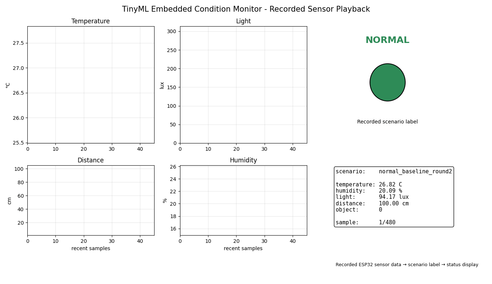

